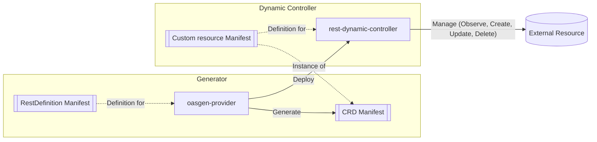
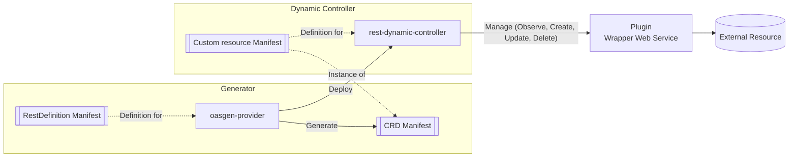

# Rest Dynamic Controller

The `rest-dynamic-controller` is an operator instantiated by the [oasgen-provider](https://github.com/krateoplatformops/oasgen-provider) to manage Custom Resources whose Custom Resource Definitions (CRDs) are generated by the `oasgen-provider`.

Extended and detailed information about the overall setup and usage of the `oasgen-provider` and `rest-dynamic-controller` can be found in the [oasgen-provider README](https://github.com/krateoplatformops/oasgen-provider/blob/main/README.md).

## Table of Contents

- [Overview](#overview)
- [How It Works](#how-it-works)
- [Architecture](#architecture)
- [Usage Examples](#usage-examples)
- [Configuration](#configuration)

## Overview

The `rest-dynamic-controller` is a dynamic controller that manages Remote Resources through REST APIs. It's considered **"dynamic"** because it can manage any type of remote resource represented by a Custom Resource Definition and its related Custom Resource. The controller is configured at startup through environment variables (or CLI parameters) to manage a specific Group Version Resource.

## How It Works

When a Custom Resource (CR) is created and its Custom Resource Definition (CRD) has been generated by a `RestDefinition` from the `oasgen-provider`, the following process occurs:

1. The `rest-dynamic-controller` instance checks if the remote resource exists by following the instructions defined in the [`RestDefinition`](https://doc.crds.dev/github.com/krateoplatformops/oasgen-provider).
2. If the resource doesn't exist, the controller performs the action described in the `verbsDescription` field of the `RestDefinition` CR.
3. For deletion requests, a similar process is followed.
4. During resource observation, the controller verifies if the remote resource is synchronized with the CR and performs updates if necessary.

## Architecture

### Standard scenario


<br/>
The diagram illustrates how the OASGen Provider processes OpenAPI Specifications to generate CRDs and deploy the Rest Dynamic Controller (RDC). The RDC manages custom resources and interacts with external APIs.

### Scenario with Plugin (Wrapper Web Service)



<br/>
In this secondo scenario, very similar to the first one, the Rest Dynamic Controller interacts with an optional Plugin (Wrapper Web Service) to handle API calls. This is useful when the external API does not conform to the expected interface or requires additional processing.

## Usage Examples

Here's an example of a Custom Resource manifest:

```yaml
apiVersion: github.ogen.krateo.io/v1alpha1
kind: Repo
metadata:
  name: test-repo1
  namespace: default
  annotations:
    krateo.io/connector-verbose: "true"
spec:
  configurationRef:
    name: my-repo-config
    namespace: default 
  org: krateoplatformops
  name: test-repo1
```

This manifest represents a CR of kind `Repo` with apiVersion `github.ogen.krateo.io/v1alpha1`. 

Additionally, the configuration resource for the above CR can be defined as follows:

```yaml
apiVersion: github.ogen.krateo.io/v1alpha1
kind: RepoConfiguration
metadata:
  name: my-repo-config
  namespace: default
spec:
  authentication:
    bearer:
      # Reference to a secret containing the bearer token
      tokenRef:
        name: gh-token        # Name of the secret
        namespace: default    # Namespace where the secret exists
        key: token            # Key within the secret that contains the token
```

The CRDs for Repo and RepoConfiguration were generated by the `oasgen-provider` based on the specifications in the RestDefinition shown below.


<details>
<summary><b>GitHub Repo RestDefinition</b></summary>

```yaml
kind: RestDefinition
apiVersion: ogen.krateo.io/v1alpha1
metadata:
  name: repo
spec:
  oasPath: configmap://repo-ns/repo/repo.yaml
  resourceGroup: github.ogen.krateo.io
  resource: 
    kind: Repo
    additionalStatusFields:
      - name
      - id
      - html_url
    verbsDescription:
    - action: create
      method: POST
      path: /orgs/{org}/repos
    - action: delete
      method: DELETE
      path: /repos/{org}/{name}
    - action: get
      method: GET
      path: /repos/{org}/{name}
    - action: update
      method: PATCH
      path: /repos/{org}/{name}
```
</details>

## Configuration

### Environment Variables

The following environment variables can be configured in the rest-dynamic-controller's Deployment:

| Name | Description  | Default Value |
|------|--------------|---------------|
| REST_CONTROLLER_DEBUG | Enable verbose output | `false` |
| REST_CONTROLLER_WORKERS | Number of worker threads | `1` |
| REST_CONTROLLER_RESYNC_INTERVAL | Interval between resyncs | `1m` |
| REST_CONTROLLER_GROUP | Resource API group | - |
| REST_CONTROLLER_VERSION | Resource API version | - |
| REST_CONTROLLER_RESOURCE | Resource plural name | - |
| REST_CONTROLLER_NAMESPACE | Namespace to watch for CRs | `""` (all namespaces) |
| REST_CONTROLLER_MAX_ERROR_RETRY_INTERVAL | The maximum interval between retries when an error occurs. This should be less than the half of the resync interval. | `30s` | 
| REST_CONTROLLER_MIN_ERROR_RETRY_INTERVAL | The minimum interval between retries when an error occurs. This should be less than max-error-retry-interval. | `1s` | 
| REST_CONTROLLER_MAX_ERROR_RETRIES | How many times to retry the processing of a resource when an error occurs before giving up and dropping the resource. | `5` |
| REST_CONTROLLER_METRICS_SERVER_PORT | The port where the metrics server will be listening. If not set, the metrics server is disabled. |  |
| REST_CONTROLLER_IDENTIFIER_MATCH_POLICY | Policy to match identifier fields when checking if a remote resource exists. Possible values are "AND" (all fields must match) and "OR" (at least one field must match). | `OR` |
